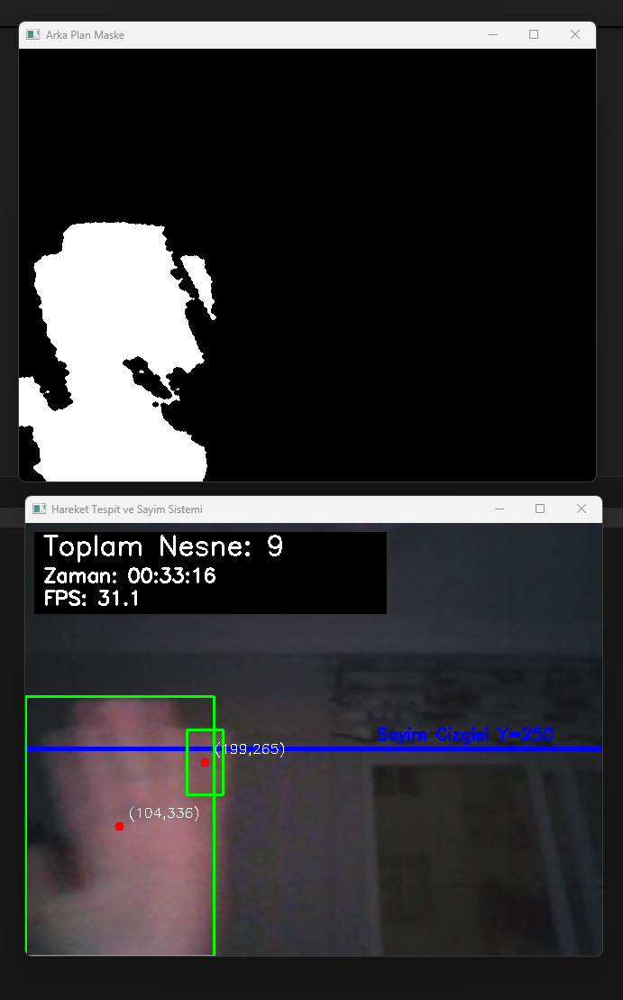

Objects Count – Real-Time Object Counting System

This project is a real-time object counting system designed for industrial or smart-camera applications. Using motion detection and OpenCV, the system identifies moving objects in video streams and tracks them as they cross a defined counting line.

Features

- Real-time motion-based object detection and tracking
- Automatic object counting via virtual line crossing
- Configurable counting line (Y-axis threshold)
- Frame-per-second (FPS) and time tracking
- Graphical interface with object count and live status
- Adaptable to conveyor belts, security feeds, and smart camera setups

Technologies Used

- Python 3.x
- OpenCV (cv2)
- NumPy
- Custom logic for movement-based tracking (no YOLO or deep learning dependency)

Industrial Applications

This system can be integrated into:

- Conveyor belt systems to count products
- Entry/exit tracking in logistics or manufacturing
- Object flow analysis for automated inspection
- Smart camera applications with low hardware requirements

Example Output
Example screenshot with bounding boxes and real-time status:

